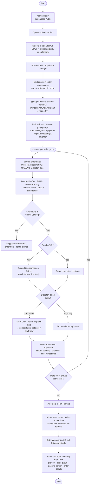

# Admin Flow — Invoice Upload Spec

## 1. Overview
Admin uploads a platform invoice PDF (Amazon / Myntra / Flipkart / Pepperfry). A backend microservice detects the platform, splits the PDF into per-order page groups, extracts order data, maps each line item against the Master Catalog, expands combos, resolves the dispatch date, and writes each order to Supabase — where it becomes visible to staff in real time. Admin also has a read-only "Staff View" to see exactly what packing staff see.

## 2. Flow (Flowchart)



## 3. Nested Outline

- **Upload**
  - Admin logs in (Supabase Auth)
  - Opens Upload section
  - Selects & uploads a PDF — one PDF = multiple orders, all from **one platform**
- **Ingestion** (automatic, Render microservice)
  - PDF → Supabase Storage → file path passed to Next.js → Render
  - Platform auto-detected from PDF content (pymupdf)
  - PDF split into per-order page groups
    - Amazon / Myntra → 2 pages per order
    - Flipkart / Pepperfry → 1 page per order
- **Per order group** (loop)
  - Extract: Order ID, Platform SKU, Qty, AWB number, Dispatch date
  - Lookup Platform SKU → Master Catalog → Internal SKU + name + dimensions
    - **Not found** → flagged, order held, admin alerted (does not proceed to DB write)
    - **Found** → continue
  - Combo check
    - **Combo** → expand into component SKUs, each written as its own line item
    - **Not combo** → single line item
  - Dispatch date check
    - **Different from today** → stored under its actual dispatch date (Myntra: upload date used as proxy when no explicit date)
    - **Same as today** → stored under today's date
  - Write order row to Supabase — `status: pending`, dispatch date, timestamp
- **Completion**
  - Admin dashboard updates live (Supabase Realtime)
  - Orders appear in staff pick list automatically, no refresh needed
  - Admin can open a **read-only Staff View** — same pick list / pack queue / packing screen / order details staff see

## 4. Suggested Data Model (TypeScript)

```ts
type PlatformName = "Amazon" | "Myntra" | "Flipkart" | "Pepperfry";

interface UploadJob {
  id: string;
  platform: PlatformName;     // auto-detected
  filePath: string;           // Supabase Storage path
  uploadedAt: string;         // ISO timestamp
  orderGroupCount: number;
  status: "processing" | "done";
}

interface ParsedOrder {
  orderId: string;
  platform: PlatformName;
  awb: string;
  dispatchDate: string;       // ISO date — actual ship date, may differ from upload date
  status: "pending" | "flagged";
  lineItems: LineItem[];
  createdAt: string;          // ISO timestamp
}

interface LineItem {
  platformSku: string;
  internalSku: string | null;   // null when unmatched → order flagged
  productName: string | null;
  quantity: number;
  isComboComponent: boolean;
  comboParentSku?: string;      // present when this line is a component of a combo
}

interface MasterCatalogEntry {
  platformSku: string;
  internalSku: string;
  productName: string;
  dimensions: string;
  isCombo: boolean;
  comboComponents?: { internalSku: string; name: string; quantity: number }[];
}
```

## 5. Tech notes (as drawn)

- Auth: Supabase Auth (same as staff)
- File storage: Supabase Storage → file path handed to Next.js
- Parsing: Next.js → Render microservice → pymupdf (platform detection + page-group extraction)
- Persistence: Supabase DB, `status: pending` on write
- Live updates: Supabase Realtime — both admin dashboard and staff pick list update without refresh
- Staff View inside admin dashboard is explicitly **read-only**

## 6. Open questions

1. When a SKU is unmatched and the order is flagged/held, does parsing still continue to the next order group in the same PDF, or does the whole PDF pause? (Diagram shows no return arrow from the flagged node back into the loop.)
2. Is there a resolution path — e.g. admin adds the missing SKU to the Master Catalog and the held order gets reprocessed automatically, or is that a fully manual re-upload?
3. For Myntra's "upload date as proxy" — is that the *only* platform without an explicit dispatch date field, or should the same fallback apply to any platform where the field is missing/unparseable?
