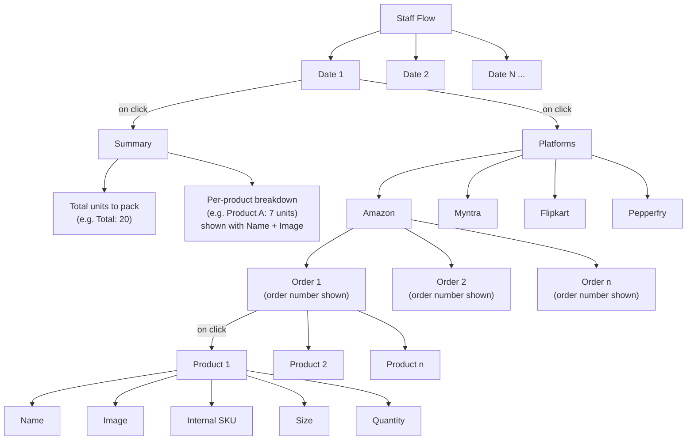

# Staff Flow — Feature Spec

## 1. Overview
A staff-facing view of the picklist tool, organized by date. Each date expands (on click) into two collapsible sections: **Summary** and **Platforms**, so packing staff can see what needs to be packed that day, either as an aggregate count or broken down by marketplace → order → product.

## 2. UI Hierarchy (Flowchart)



*(Myntra / Flipkart / Pepperfry expand into the same Order → Product → Fields structure as Amazon — omitted above to keep the diagram readable.)*

## 3. Nested Outline (component tree)

- **Date [1..N]** — collapsed by default
  - on click → expands:
    - **Summary**
      - `totalUnits`: total products to pack that day, across all platforms (e.g. 20)
      - `productBreakdown[]`: per-product aggregate (e.g. "Product A: 7"), each shown with **name + image**
    - **Platforms**
      - Amazon
      - Myntra
      - Flipkart
      - Pepperfry
      - each platform →
        - **Order [1..n]** — order number shown at this level
          - on click → expands to:
            - **Product [1..n]** in that order
              - `name`
              - `image`
              - `internalSku`
              - `size`
              - `quantity`

## 4. Suggested Data Model (TypeScript)

```ts
interface DailyPackingView {
  date: string;              // ISO date
  summary: PackingSummary;
  platforms: PlatformOrders[];
}

interface PackingSummary {
  totalUnits: number;                 // e.g. 20
  productBreakdown: ProductSummaryItem[];
}

interface ProductSummaryItem {
  name: string;
  imageUrl: string;
  quantity: number;          // e.g. 7
}

type PlatformName = "Amazon" | "Myntra" | "Flipkart" | "Pepperfry";

interface PlatformOrders {
  platform: PlatformName;
  orders: Order[];
}

interface Order {
  orderNumber: string;   // shown on the order row before expanding
  products: Product[];   // revealed on click
}

interface Product {
  name: string;
  imageUrl: string;
  internalSku: string;
  size: string;
  quantity: number;
}
```

## 5. Assumptions made (flag if wrong)

1. **Summary** aggregates products **across all 4 platforms** for that date (not per-platform totals).

## Confirmed

- Product fields (Name, Image, Internal SKU, Size, Quantity) apply the same way under every platform — only drawn once under Amazon for space.
- Summary and Platforms are both visible simultaneously under a date, not tabs/mutually exclusive.
- Order rows show the order number; clicking expands to the product(s) in that order.
- Summary's `productBreakdown` is a raw packing count per product — no platform breakdown.

## 6. Open questions

None remaining.
